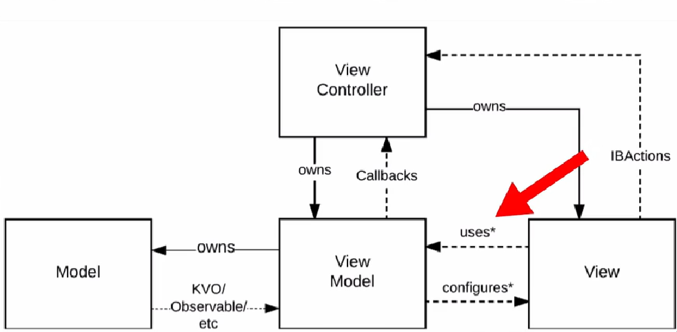
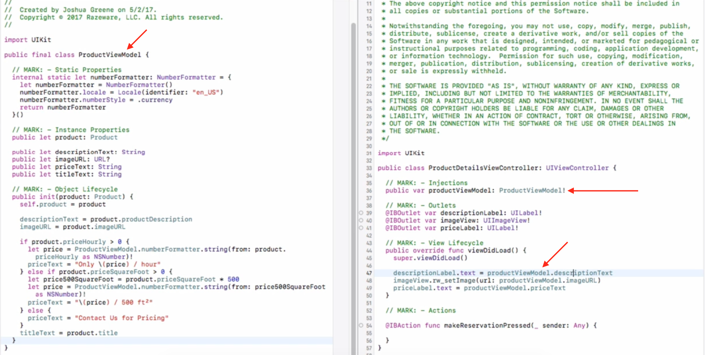

# MVC-N

## Model View Controller Networking

Model View Controller, separa objetos en tres tipos, Models, Views, Controllers.

Con **MVC-N** tenemos una capa de **Network Client** (lógica de Networking con un clousure callback).

Sabeos que el ViewController se comunica con el View, pero ahora lo hará tambien con el **Network Client** y este se comu nicará con el **Model**.

## MVVM 

Separa los objetos en tres tipos, Models, Views y ViewModels.
La arquitectura es como sigue:

La idea es separar la logica de negocio en el MVVM, en el siguiente código se puede apreciar

`NSMapTable<Key, Value>` es parecido a un `NSDictionary` pero la diferencia radica en que en `NSMapTable` las referencias pueden ser de tipo **weak** usando `weakToStrongObjects()` y en el `NSDictionary` siempre son las referencias de tipo **strong**.

