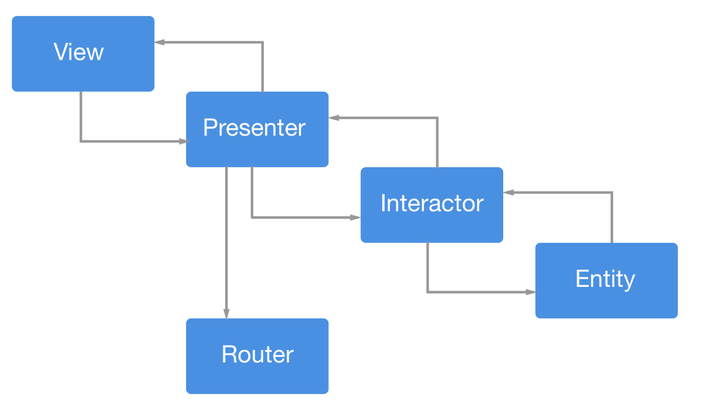
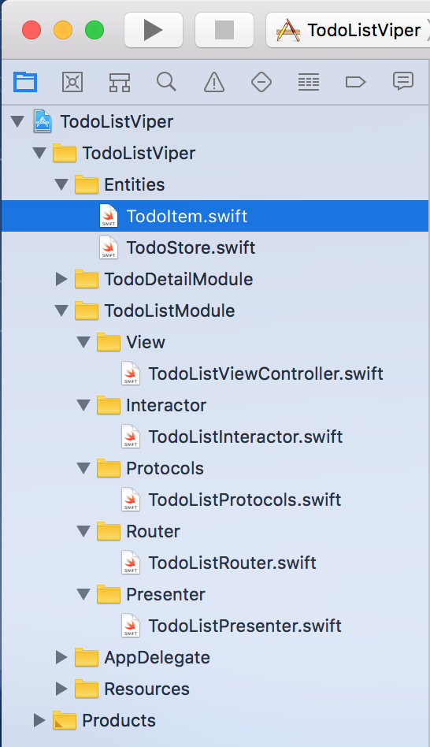

# VIPER

## Introduction

**VIPER** , es un patrón de arquitectura relacionado con *Clean Architecture Pradigm*. **VIPER**  es un patrón de diseño estructural para facilitar el acoplamiento entre clases.



**V**: **View**, es básicamente una Vista, la idea es hacer la Vista lo mas **tonta** posible y que *solo se preocupe de mostrar la UI*. Es básicamente un protocolo que van a implementar nuestros *ViewControllers*. Las vistas esperan a que les lleguen los datos del **Presenter**.

**I**: El **Interactor** se preocupa de ejecutar cualquier acción cuando el *Presenter* lo diga. El interactor lleva la **lógica de negocio**, va a tratar con las clases **Entity**, manejar su lógica y es el que va a pasarle al **Presenter** la información que necesita para la **Vista**.

**P**: El **Presenter**, es la **cabeza**. Es decir, él ordena cualquier acción haciendo uso del **Interactor**, le dice al **View** que contenido mostrar, y ordena la navegación a otras pantallas usando el **Router**. Es el **intermediario entre la Vista y el Interactor**:

> View <---> Presenter <---> Interactor

Presenter va a **recibir eventos de la vista**, (cuando el usuario pulse un botón) y se va a limitar a **pasarlo al Interactor** (quien decide que hacer). Luego informará al **Presenter** y le pasará la info que necesita. 

El **Interactor** se comunica con los **Entities**.
**OJO** nunca vamos a pasar una **Entity** al Presenter, hay que pasarle todo limpio, datos simples, etc.

> View <---> Presenter <---> Interactor <---> Entity

**E**: Las **Entity**, representa la **data** o mejor dicho, actua como un **Model** en el patrón **MVP**. 
Son **objetos de negocio con los que tratará el Interactor**. 

**OJO** hay que considerar, que si las Entidades llegan por un **WS** debemos añadir una capa extra que haga las solicitudes y le pase las entidades construidas al Interactor.

**R**: De **Routing**, se encarga de la navegación entre pantallas. La lógica de presentación de las pantallas. Responsable de instanciar las vistas, interactors, y presenters. Los **Presenters notifican al Routing que se ha de navegar a X pantalla**.


## Ejemplo

### View

```Swift
/*
 * Protocol that defines the view input methods.
 */
protocol ArticlesViewInterface: class {
    func showArticlesData(articles: [Article])
    func showNoContentScreen()
}

/*
 * A view responsible for displaying a list
 * of articles fetched from some source.
 */
class ArticlesViewController : UIViewController, ArticlesViewInterface {

    // Reference to the Presenter's interface.
    var presenter: ArticlesModuleInterface!

    /*
     * Once the view is loaded, it sends a command
     * to the presenter asking it to update the UI.
     */
    override func viewDidLoad() {
        super.viewDidLoad()
        self.presenter.updateView()
    }

    // MARK: ArticlesViewInterface

    func showArticlesData(articles: [Article]) {
        self.articles = articles
        self.tableView.reloadData()
    }

    func showNoContentScreen() {
        // Show custom empty screen.
    }
}
```

### Presenter

```Swift
/*
 * Protocol that defines the commands sent from the View to the Presenter.
 */
protocol ArticlesModuleInterface: class {
    func updateView()
    func showDetailsForArticle(article: Article)
}


/*
 * Protocol that defines the commands sent from the Interactor to the Presenter.
 */
protocol ArticlesInteractorOutput: class {
    func articlesFetched(articles: [Article])
}


/*
 * The Presenter is also responsible for connecting
 * the other objects inside a VIPER module.
 */
class ArticlesPresenter : ArticlesModuleInterface, ArticlesInteractorOutput {

    // Reference to the View (weak to avoid retain cycle).
    weak var view: ArticlesViewInterface!

    // Reference to the Interactor's interface.
    var interactor: ArticlesInteractorInput!

    // Reference to the Router
    var wireframe: ArticlesWireframe!


    // MARK: ArticlesModuleInterface

    func updateView() {
        self.interactor.fetchArticles()
    }

    func showDetailsForArticle(article: Article) {
        self.wireframe.presentDetailsInterfaceForArticle(article)
    }

    // MARK: ArticlesInteractorOutput

    func articlesFetched(articles: [Article]) {
        if articles.count > 0 {
            self.articles = articles
            self.view.showArticlesData(articles)
        } else {
            self.view.showNoContentScreen()
        }
    }
}
```

### Entity

Example of an Entity:

```Swift
class Article {
    var date: String?
    var title: String?
    var website: String?
    var authors: String?
    var content: String?
    var imageUrl: String?
}
```

### Interactor

The Interactor would be responsible for fetching the (data) articles from an API.
 
```Swift
/*
 * Protocol that defines the Interactor's use case.
 */
protocol ArticlesInteractorInput: class {
    func fetchArticles()
}


/*
 * The Interactor responsible for implementing
 * the business logic of the module.
 */
class ArticlesInteractor : ArticlesInteractorInput {

    // Url to the desired API.
    let url = "https://www.myendpoint.com"

    // Reference to the Presenter's output interface.
    weak var output: ArticlesInteractorOutput!


    // MARK: ArticlesInteractorInput

    func fetchArticles() {
        Alamofire.request(.GET, url).responseArray { (response: Response) in
            let articlesArray = response.result.value
            self.output.articlesFetched(articlesArray!)
        }
    }
}
```

### Router

The Router should implement a protocol that defines all the navigation possibilities for a specific module. Only ViewControllers can perform a transition between screens, so a Router must contain a reference to the module’s controller, or any of its children. (Router is widely referred to as Wireframe).

```Swift
/*
 * Protocol that defines the possible routes from the Articles module.
 */
protocol ArticlesWireframeInput {
    func presentDetailsInterfaceForArticle(article: Article)
}


/*
 * The Router responsible for navigation between modules.
 */
class ArticlesWireframe : NSObject, ArticlesWireframeInput {

    // Reference to the ViewController (weak to avoid retain cycle).
    weak var articlesViewController: ArticlesViewController!

    // Reference to the Router of the next VIPER module.
    var detailsWireframe: DetailsWireframe!


    // MARK: ArticlesWireframeInput

    func presentDetailsInterfaceForArticle(article: Article) {
        // Create the Router for the upcoming module.
        self.detailsWireframe = DetailsWireframe()

        // Sends the article data to the next module's Presenter.
        self.sendArticleToDetailsPresenter(self.detailsWireframe.detailsPresenter, article: article)

        // Presents the next View.
        self.detailsWireframe.presentArticleDetailsInterfaceFromViewController(self.articlesViewController)
    }


    // MARK: Private

    private func sendArticleToDetailsPresenter(detailsPresenter: DetailsPresenter, article: Article) {
        detailsPresenter.article = article
    }
}
```

## Example 2, Todo List

Estructura de la App, se aprecia la carpeta **Entities**, y dos modulos **TodoDetailModule** y **TodoListModule**, cada uno con subcarpetas reverentes a **VIPER**, es decir, View, Interactor, Protocols, Router, Presenter.



### Entities
Los *Entities* ([TodoItem](https://github.com/richimf/DesignPatterns/blob/master/Swift/VIPER/examples/example2/TodoListViper/Entities/TodoItem.swift) y [TodoStore](https://github.com/richimf/DesignPatterns/blob/master/Swift/VIPER/examples/example2/TodoListViper/Entities/TodoStore.swift)) son modelos. 

- `TodoItem` is just a plain class that represent a `TodoItem` object. 
- `TodoStore` is the DataStore Singleton object that stores the list of `TodoItem`. 

``` Swift
import Foundation

class TodoItem {
    
    var title: String
    var content: String
    
    init(title: String, content: String) {
        self.title = title
        self.content = content
    }
}
```

### Module: TodoListModule
#### View:

El [View](https://github.com/richimf/DesignPatterns/blob/master/Swift/VIPER/examples/example2/TodoListViper/TodoListModule/View/TodoListViewController.swift) es un ViewController, donde se invoca al `presenter`.

``` Swift
import UIKit

class TodoListViewController: UITableViewController {
    var presenter: TodoListPresenterProtocol?
	 ...
	
	override func tableView(_ tableView: UITableView, didSelectRowAt indexPath: IndexPath) {
        let todo = todos[indexPath.row]
        presenter?.showTodoDetail(todo)
    }
}
extension TodoListViewController: TodoListViewProtocol {
    
    func showTodos(_ todos: [TodoItem]) {
        self.todos = todos
    }
    ...
}
```

#### Protocols:

Usamos los protocolos en cada componente para definir como se comunicarán con el modulo `TodoList`.

``` Swift
protocol TodoListViewProtocol: class {
    
    var presenter: TodoListPresenterProtocol? { get set }
    
    // PRESENTER -> VIEW
    func showTodos(_ todos: [TodoItem])
    func showErrorMessage(_ message: String)
}
```
``` Swift
protocol TodoListPresenterProtocol: class {
    
    var view: TodoListViewProtocol? { get set }
    var interactor: TodoListInteractorInputProtocol? { get set }
    var router: TodoListRouterProtocol? { get set }
    
    // VIEW -> PRESENTER
    func viewWillAppear()
    func showTodoDetail(_ Todo: TodoItem)
    func addTodo(_ todo: TodoItem)
    func removeTodo(_ todo: TodoItem)
}
```

### Implementando los Protocols

TodoListViewController responsibility is to display the user interface as told by the presenter.  It keeps a reference to the presenter to relay user input and view lifecycle event to the presenter to react.


## Fuentes

[Building iOS App With VIPER - cheesecakelabs.com](https://cheesecakelabs.com/blog/ios-project-architecture-using-viper/)

[Building Todo List iOS App with VIPER Architecture - medium.com](https://medium.com/swift2go/building-todo-list-ios-app-with-viper-architecture-bc954ea371bb)

[Tutorial Viper - adictosaltrabajo.com](https://www.adictosaltrabajo.com/tutoriales/viper/)